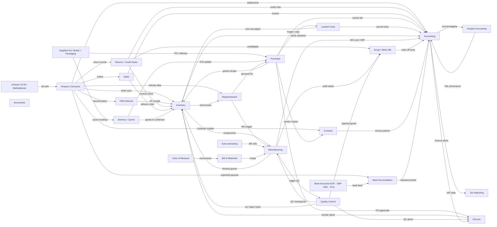

# SLSK Ventures - Odoo ERP Architecture

## Module Notes
### Amazon 10 EU Marketplaces
- ID: `amazon_ext`
- SLSK's 10 storefronts: DE, FR, UK, IT, ES, NL, BE, SE, IE, PL — plus Amazon.fr registered under FR SIREN 914935374. Source of all order, settlement and FBA inventory adjustment data.

### Suppliers EU Seeds + Packaging
- ID: `suppliers_ext`
- Organic seed suppliers across Europe (Italy confirmed; also NL, DE, PL and others) + Asian packaging suppliers. Multiple EU origins: each supplier needs country-of-origin, organic certification body, and species-specific UoM convention recorded in Odoo.

### Bank Accounts EUR · GBP · SEK · PLN
- ID: `bank_ext`
- SLSK settlement bank accounts per currency. Amazon pays bi-weekly per marketplace. Bank statements imported via Odoo bank sync or CSV. FX rate at settlement date applied for multi-currency reconciliation.

### Amazon Connector
- ID: `amazon_connector`
- SP-API bridge: order sync, inventory sync, settlement import, FBA inbound plan creation — all 10 accounts. GAP: Settlement transaction-type→GL mapping required (50+ types: referral fees, FBA storage, A-to-Z claims, promotions). UK Marketplace Facilitator post-Brexit fiscal position also needed.

### Sales
- ID: `sales`
- Processes inbound Amazon orders; triggers delivery orders and customer invoices. GAP: Fiscal position auto-selection must distinguish OSS-eligible cross-border sales from locally-taxed sales when FBA inventory is stored in the destination country (PAN-EU FBA complexity).

### FBA Inbound
- ID: `fba_inbound`
- Creates and tracks FBA Inbound Shipment Plans for all 10 Amazon FCs. GAP: Standard Connector creates basic plans only. Custom logic needed to auto-detect Amazon FC split assignments, generate PRE labels, and reconcile Amazon-received qty vs. shipped qty to auto-trigger discrepancy claims.

### Contacts
- ID: `contacts`
- res.partner master shared by all modules. CUSTOMISATION: Add fields for EU organic cert code per supplier (LU-BIO-04), 3PL SLA parameters, Amazon seller account ID, and country-of-origin per supplier — essential now that seeds come from multiple EU countries.

### Discuss
- ID: `discuss`
- Internal chat & automated notifications. SETUP: Configure scheduled actions for: QC failures (immediate alert), settlement anomalies (finance ping), VAT filing deadlines (2-week advance), FBA stock below safety level (reorder team). Keeps 4–6 person team in sync.

### Documents
- ID: `documents`
- Files linked directly to Odoo records. REQUIRED: Attach EU organic certs (LU-BIO-04) at both supplier level AND each incoming lot. Phytosanitary certificates per seed shipment PO. 3PL batch records per MO. GAP: Enforce naming convention via document types; missing cert should block lot release in Quality.

### Purchase
- ID: `purchase`
- Demand-driven POs to EU seed suppliers and Asian packaging suppliers. CUSTOMISATION: Dual-UoM PO lines (kg and per-seed-count on the same PO). Validation rule: block count-based PO lines for any species without a validated weight-per-seed constant in its BOM. Multi-supplier routing rules per species.

### Delivery / Carrier
- ID: `delivery`
- Tracks physical shipments: EU seeds→3PL, Asian packaging→3PL, 3PL→FBA inbound. GAP: Carrier API integration (DHL/DPD for EU parcels; freight forwarder for sea containers) must be configured or entered manually. Custom ETA field on each PO line drives dynamic replenishment lead times.

### Landed Costs
- ID: `landed_costs`
- Allocates import freight, customs duty and insurance to each SKU unit cost. IMPROVEMENT: Split by cost type (sea freight / air freight / customs duty / insurance) as separate lines for accurate COGS breakdown. Auto-apply rule for all non-EU purchase receipts (Asian packaging only).

### Inventory
- ID: `inventory`
- Central stock hub: virtual 3PL location, 10 FBA virtual locations, lot/batch tracking, reorder rules. CUSTOMISATION: Species-specific expiry rules on seed lots. Custom adjustment reason codes (FBA damaged, FBA lost, yield waste). Split 3PL virtual location into: raw seeds / packaging / WIP / finished-not-shipped.

### Replenishment
- ID: `replenishment`
- Min/max and MTO reorder rules for all 10 FBA virtual locations plus 3PL safety stock. CUSTOMISATION: Dynamic safety-stock multiplier from FBA sales velocity (fed by Amazon Connector). Lead-time tiers: EU seeds ~14d, Asian packaging ~60d, 3PL assembly ~5d. MTO rules trigger sub-contracting MOs, not just POs.

### Accounting
- ID: `accounting`
- Settlement reconciliation; COGS per SKU; EU VAT/OSS; multi-currency EUR/GBP/SEK/PLN. CRITICAL GAPS: (1) SKR03 vs. SKR04 COA must be chosen before go-live. (2) French entity (SIREN 914935374) type — branch vs. subsidiary — must be resolved. (3) §15a UStG VAT reversal on yield waste. (4) FX revaluation at each month-end.

### Sub-contracting
- ID: `subcontracting`
- 3PL assembly as sub-contracting MO: seeds + packaging flow OUT to 3PL, finished packs flow IN. Replaces Work Centers model — the correct Odoo architecture for external assembly. CUSTOMISATION: Sub-contractor service-fee PO auto-generated per MO. Custom 3PL batch-reference field on each MO.

### Manufacturing
- ID: `manufacturing`
- Sub-contracting MOs track seed kg consumed, units produced, yield loss per BOM. GAPS: (1) Loss buffer % (5% illustrative) must be validated across ≥3 pilot packing runs before go-live. (2) Per-species weight-per-seed constants must be measured — not estimated. (3) WIP accounting entries (seeds→WIP→finished goods) require explicit GL mapping.

### Quality Control
- ID: `quality`
- 4 QC checkpoints: seed receipt, packaging receipt, post-assembly, FBA inbound prep. CUSTOMISATION: Numeric fields for germination % and fill weight on QCP (not just pass/fail binary). Auto-escalation email to 3PL supervisor + SLSK management on failure. Defect-rate trend dashboard per EU supplier per species.

### Scrap / Write-offs
- ID: `scrap`
- Inventory write-offs for: yield waste, 3PL or FBA damage, expired seed lots. CUSTOMISATION: Custom scrap reason codes mapped to separate GL accounts — yield waste→COGS, FBA damage→Amazon reimbursement receivable, expiry→stock obsolescence expense. §15a UStG VAT reversal trigger on destroyed-goods orders.

### Analytic Accounting
- ID: `analytic_acctg`
- Tags every journal entry for per-marketplace and per-brand P&L — required to deliver the stated ROI promise. REQUIRED SETUP: Two analytic dimensions: Marketplace (DE/FR/UK/IT/ES/NL/BE/SE/IE/PL) and Brand (ZenGreens / VEVOX / SLSK Games). Amazon Connector must auto-tag each settlement entry by source marketplace.

### Bank Reconciliation
- ID: `bank_reconcil`
- Matches Amazon bi-weekly settlement payouts to bank credits in 4 currencies. SETUP: One Odoo bank journal per currency (EUR, GBP, SEK, PLN). FX revaluation wizard at month-end for unrealized gains/losses on open positions. Bank feed via Odoo bank sync or CSV import per account.

### Bill of Materials
- ID: `bom`
- RM (seed kg) + PM (packaging) + M (3PL labour) per SKU; 3 size variants per species (10g, 200g, 500g). CUSTOMISATION: Per-BOM weight-per-seed constant field (validated by pilot runs). BOM version control — lock historical MOs against retroactive recalculation when loss buffer changes after pilot data.

### Units of Measure
- ID: `uom`
- 3D UoM: kg (bulk purchase) ↔ individual seed count (count POs) ↔ consumer pcs (sales). CRITICAL GAP: Odoo standard UoM cannot store per-product conversion factors — a custom field on product.template is required for the species-specific weight-per-seed constant that drives correct conversion at PO receipt and MO consumption.

### Returns / Credit Notes
- ID: `returns`
- Amazon FBA customer return flow: credit note + reverse stock move + unfulfillable write-off. GAP: Standard Odoo requires manual creation of return delivery + credit note per event. Custom automation from Amazon return notification (via Connector) to create both records — reducing manual work across 10 marketplaces.

### Tax Reporting
- ID: `tax_reporting`
- OSS quarterly return, German VAT Voranmeldung, EC Sales List. GAPS: (1) PAN-EU FBA: fiscal position must use fulfillment-origin location (which FC shipped), not just customer country — standard Odoo does not do this automatically. (2) UK: Amazon remits VAT on orders <£135 (Marketplace Facilitator) — Odoo must mark these as zero-rated export.
